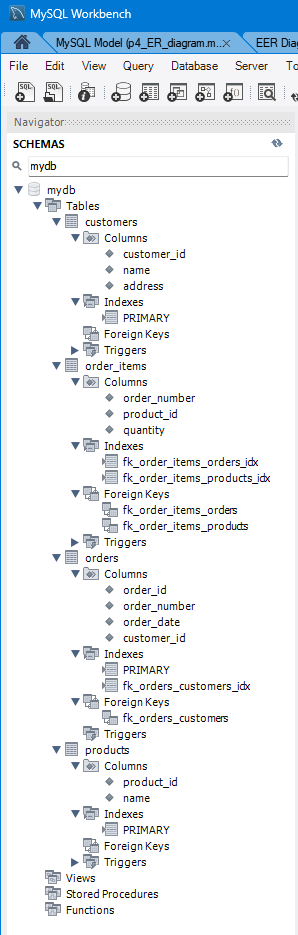

# goit-rdb-hw-02 <br> Проектування баз даних з використанням семантичних моделей

Початкова таблиця


[Google-таблиця з перетвореннями](https://docs.google.com/spreadsheets/d/1labmFWTjyYytsHjhj_6Agy065wMdWhXTlXE4Wpnu1N8/edit?usp=sharing)

## 1. Приведення початкової таблиці в першу нормальну форму


## 2. Приведення в другу нормальну форму


## 3. Приведення в третю нормальну форму


## 4. ER-діаграма розроблених таблиць

ER-діаграма представлена у файлі `p4_ER_diagram.mwb`


## 5. Створена база даних на основі розробленої ER-діаграми

SQL-код у файлі `p5_cdated_DB.sql`

```SQL
-- MySQL Workbench Forward Engineering

SET @OLD_UNIQUE_CHECKS=@@UNIQUE_CHECKS, UNIQUE_CHECKS=0;
SET @OLD_FOREIGN_KEY_CHECKS=@@FOREIGN_KEY_CHECKS, FOREIGN_KEY_CHECKS=0;
SET @OLD_SQL_MODE=@@SQL_MODE, SQL_MODE='ONLY_FULL_GROUP_BY,STRICT_TRANS_TABLES,NO_ZERO_IN_DATE,NO_ZERO_DATE,ERROR_FOR_DIVISION_BY_ZERO,NO_ENGINE_SUBSTITUTION';

-- -----------------------------------------------------
-- Schema mydb
-- -----------------------------------------------------

-- -----------------------------------------------------
-- Schema mydb
-- -----------------------------------------------------
CREATE SCHEMA IF NOT EXISTS `mydb` DEFAULT CHARACTER SET utf8 ;
USE `mydb` ;

-- -----------------------------------------------------
-- Table `mydb`.`customers`
-- -----------------------------------------------------
CREATE TABLE IF NOT EXISTS `mydb`.`customers` (
  `customer_id` INT UNSIGNED NOT NULL,
  `name` VARCHAR(100) NOT NULL,
  `address` VARCHAR(100) NOT NULL,
  PRIMARY KEY (`customer_id`))
ENGINE = InnoDB;


-- -----------------------------------------------------
-- Table `mydb`.`orders`
-- -----------------------------------------------------
CREATE TABLE IF NOT EXISTS `mydb`.`orders` (
  `order_id` INT UNSIGNED NOT NULL,
  `order_number` VARCHAR(12) NOT NULL,
  `order_date` DATE NOT NULL,
  `customer_id` INT UNSIGNED NOT NULL,
  PRIMARY KEY (`order_id`),
  INDEX `fk_orders_customers_idx` (`customer_id` ASC) VISIBLE,
  CONSTRAINT `fk_orders_customers`
    FOREIGN KEY (`customer_id`)
    REFERENCES `mydb`.`customers` (`customer_id`)
    ON DELETE NO ACTION
    ON UPDATE NO ACTION)
ENGINE = InnoDB;


-- -----------------------------------------------------
-- Table `mydb`.`products`
-- -----------------------------------------------------
CREATE TABLE IF NOT EXISTS `mydb`.`products` (
  `product_id` INT NOT NULL,
  `name` VARCHAR(45) NOT NULL,
  PRIMARY KEY (`product_id`))
ENGINE = InnoDB;


-- -----------------------------------------------------
-- Table `mydb`.`order_items`
-- -----------------------------------------------------
CREATE TABLE IF NOT EXISTS `mydb`.`order_items` (
  `order_number` INT UNSIGNED NOT NULL,
  `product_id` INT NOT NULL,
  `quantity` DECIMAL(9,3) UNSIGNED NOT NULL,
  INDEX `fk_order_items_orders_idx` (`order_number` ASC) VISIBLE,
  INDEX `fk_order_items_products_idx` (`product_id` ASC) VISIBLE,
  CONSTRAINT `fk_order_items_orders`
    FOREIGN KEY (`order_number`)
    REFERENCES `mydb`.`orders` (`order_id`)
    ON DELETE NO ACTION
    ON UPDATE NO ACTION,
  CONSTRAINT `fk_order_items_products`
    FOREIGN KEY (`product_id`)
    REFERENCES `mydb`.`products` (`product_id`)
    ON DELETE NO ACTION
    ON UPDATE NO ACTION)
ENGINE = InnoDB;


SET SQL_MODE=@OLD_SQL_MODE;
SET FOREIGN_KEY_CHECKS=@OLD_FOREIGN_KEY_CHECKS;
SET UNIQUE_CHECKS=@OLD_UNIQUE_CHECKS;

```


